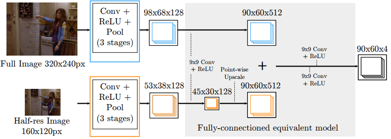
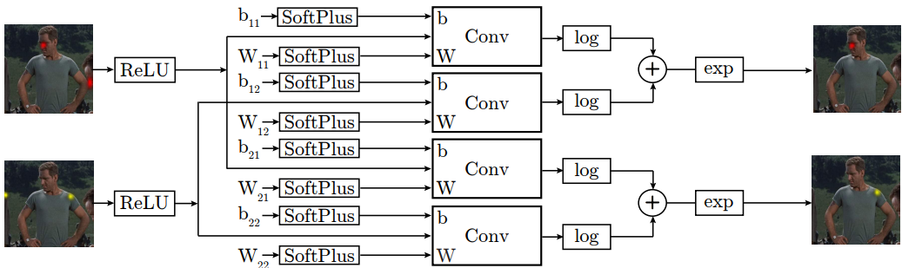

## An implementation of ["Joint Training of a Convolutional Network and a Graphical Model for Human Pose Estimation"](http://papers.nips.cc/paper/5573-joint-training-of-a-convolutional-network-and-a-graphical-model-for-human-pose-estimation)
#### Maksym Andriushchenko, Fan Yue

This is a TensorFlow implementation of [the paper](http://papers.nips.cc/paper/5573-joint-training-of-a-convolutional-network-and-a-graphical-model-for-human-pose-estimation), 
which became quite influential in the human pose estimation task.

<!-- Surprisingly, we didn't find any implementation in the internet. It can be explained by the fact that the original paper 
doesn't list any hyperparameters and doesn't provide many implementation details. Thus, it is extremely hard to
reproduce, and we decided to add reasonable modifications from the recent papers to improve the results.
-->

Here is an example of joints detection based on FLIC dataset:

Part Detector:

Spatial Model:

TODO: add 1 PD + 1 SM pictures from TensorBoard


## Main Idea
We have a fully-convolutional part detector that generates:

<!--  -->

Then we have a subnetwork which is inspired by a Markov Random Field, which aims to enforce kinematic constraints
between the joints:



TODO: add many nice pictures from TensorBoard.
TODO: detection rate curves vs the original paper
TODO: convergence of the detection rate


## Difference from the paper
Since the original paper was quite hard to reproduce, we introduced the following changes:
- BN speeds up the convergence
- Cross-entropy loss speeds up the convergence and improves the detection accuracy
- Multi-task loss
- Adam for joint training. Original paper was not really "joint".
- ...


## How to run the code
1. download FLIC dataset
2. `data.py`
3. `pairwise_distr.py`
4. `python main.py --data_augm --use_sm --optimizer=adam --lr=0.001 --lmbd=0.0001 --n_epochs=60`


Supported options:
- `debug`: 
- `multi_gpu`: BatchNorm can have problems with low batch size
- `data_augm`: 
- `use_sm`: whether to use the Spatial Model (SM) or not
- `restore_model`: if you want to restore an existing model, name of which should be specified in `best_model_name` variable.
Or you can get further information on different arguments with: `python worker.py --help`.


Datasets (you will need to have them in the folder data/, for details please see `data.py`):
- `FLIC`
- `FLIC+`

Note that the script `main.py` saves tensorboard summaries (folder `tb`), model parameters (folder `models_ex`). 


## Contact
For any questions regarding the code please contact Maksym Andriushchenko (m.**my surname**@gmail.com).
Any suggestions are always welcome.


## Citation
You can cite the original paper as:
```
@inproceedings{tompson2014joint,
  title={Joint training of a convolutional network and a graphical model for human pose estimation},
  author={Tompson, Jonathan J and Jain, Arjun and LeCun, Yann and Bregler, Christoph},
  booktitle={Advances in neural information processing systems},
  pages={1799--1807},
  year={2014}
}
```